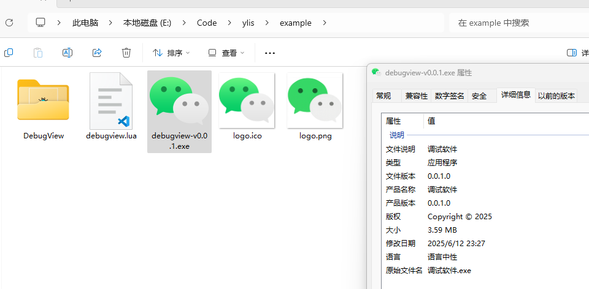
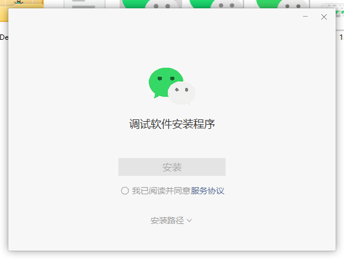
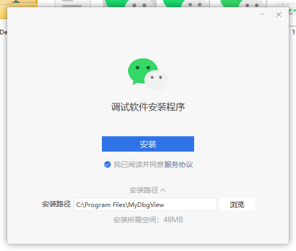
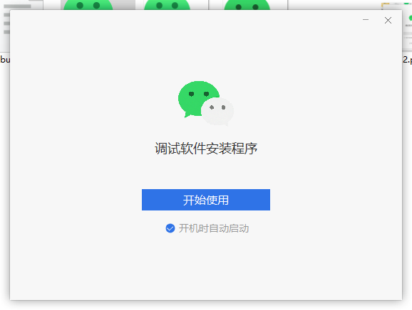
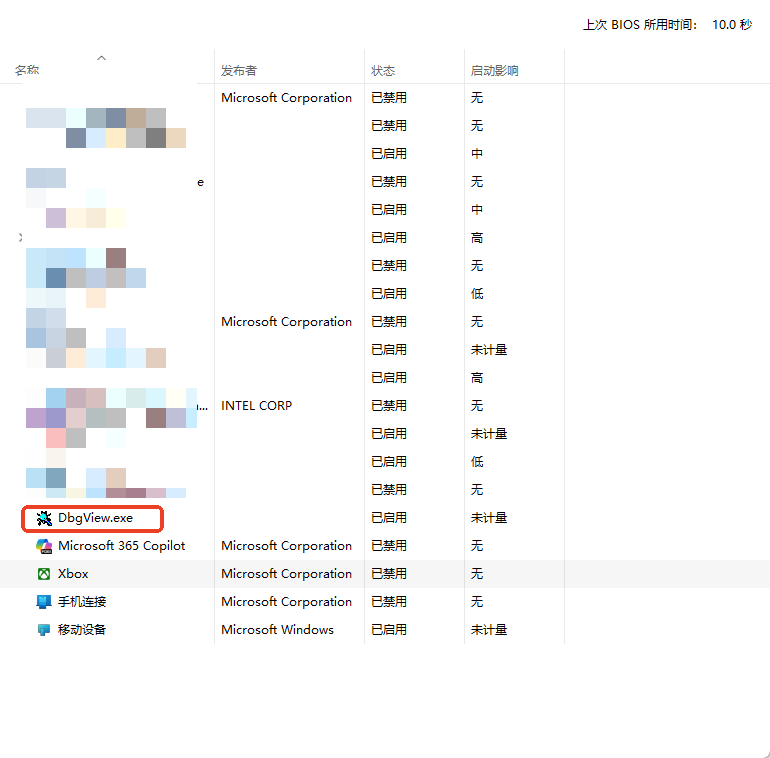
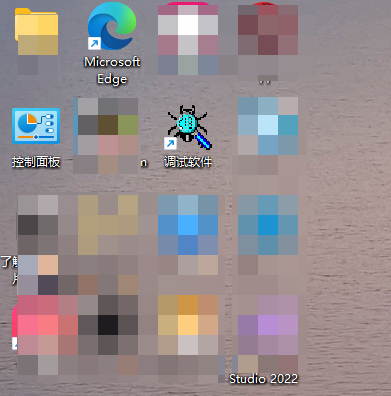
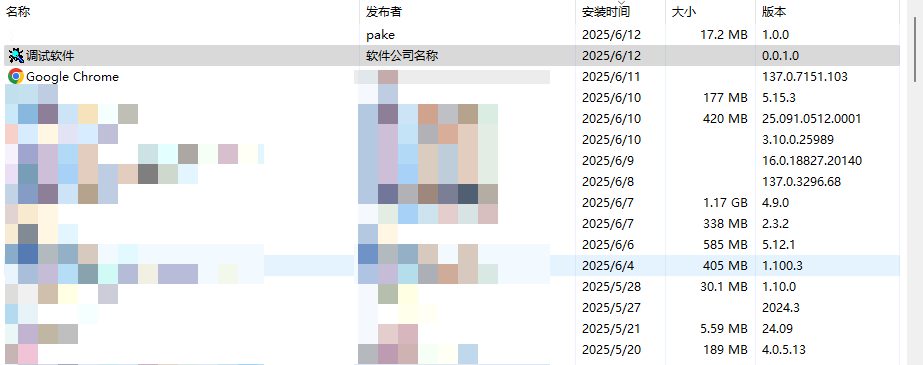
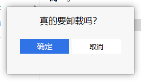
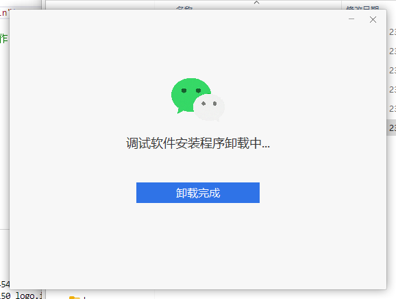

# ylis
Windows Lua Install System

windows安装包制作工具，采用LUA脚本引擎

## 项目结构
* base 网易封装的一些类库
* duilib 网易版本的duilib (有一些小修改：增加了边框状态颜色、大小)
* example 打包示例
* loader 安装包启动加载器
* resources 界面库一些皮肤布局资源
* ylis 安装包制作工具

## 编译环境
* vs2022 安装最新的windows sdk
* xmake 包依赖和项目构建工具
* cmake 第三方依赖包需要此工具编译

## 编译
```shell
git clone gitee.com/xxx/ylis.git
cd ylis.git
xmake m -f release
xmake
# output build/windows/release/ylis.exe
```

## 示例演示
* 安装包文件

* 安装界面



* 开机启动与控制面板



* 卸载界面



## 一个最简单的打包示例

```lua
-- demo1.lua

function build()
    add_file("c:\\windows\\notepad.exe", "notepad.exe")

    -- 自己找logo换上
    add_res("logo.png", "logo.png")
    add_icon("logo.ico")


    mytable = {}
    mytable["out"] = "notepad-v0.0.1.exe"
    mytable["guid"] = "{91E09AE7-3B22-4318-9383-788F1DD69E11}"      -- 软件GUID，用于在控制面板的程序卸载注册，不设置的话则不在程序卸载列表显示
    mytable["app_name"] = "记事本"                                  -- 软件名称 快捷方式也会使用这个名称
    mytable["main_bin"] = "notepad.exe"                              -- 程序入口文件名
    mytable["install_dir"] = "MyNotepad"                              -- 默认安装路径 会自动加上前缀，例如： C:\\Program Files\\Dbgview
    mytable["title"] = "我的记事本"                                    -- 标题
    mytable["master_color"] = "#ff2f73e7"                           -- 主颜色、master hot、master pushed、master disable
    mytable["bk_color"] = "#fff7f7f7"                               -- 窗口背景颜色
    mytable["btn_master_hover_color"] = "#ff5f97f3"
    mytable["btn_master_pushed_color"] = "#ff3c79ae"
    mytable["btn_master_text_color"] = "#ffffffff"
    mytable["btn_master_disable_color"] = "#ffe4e4e4"
    mytable["btn_master_disable_textcolor"] = "#ffa7a6aa"
    mytable["text_color"] = "#ff999999"
    mytable["text_link_color"] = "#ff576b95"
    mytable["btn_plain_hover_color"] = "#ff5f97f3"
    mytable["btn_plain_pushed_color"] = "#ff3c79ae"
    mytable["btn_plain_disable_color"] = "#ffe4e4e4"
    mytable["btn_plain_text_color"] = "#ff000000"
    mytable["btn_plain_disable_textcolor"] = "#ffa7a6aa"
    mytable["btn_plain_border_color"] = "#ffe7e7e7"
    mytable["edit_plaint_border_color"] = "#ffe7e7e7"
    mytable["edit_plaint_hover_border_color"] = "#ff5f97f3"
    mytable["service_agreement_url"] = "https://baidu.com"      -- 服务协议跳转链接
    mytable["service_agreement_accept_text"] = "我已阅读并同意"
    mytable["service_agreement_text"] = "服务协议"                   -- 服务协议文本
    mytable["install_button_text"] = "安装"                      -- 安装按钮文本
    mytable["run_text"] = "开始使用"
    mytable["app_size"] = "48MB"
    mytable["logo"] = "logo.png"                                    -- 设置安装包LOGO
    mytable["version"] = "0.0.1.0"
    mytable["publisher"] = "软件公司名称"
    add_opts(mytable)
end


function init()
    -- 锁定安装目录
    -- enable_install_path(0)
    local major, minor, build_number = get_os_version()
    logi("init() 当前操作系统版本：%d.%d.%d", major, minor, build_number)

    -- 示例只支持win10
    if major < 10 then
        local msg = "不支持的windows版本！"
        show_dlg(msg)
        error("os not support")
        return
    end
end

-- 释放文件前调用(可选)
function before_release()
    -- 安装前可能需要停止的进程或服务
    -- 判断是否有服务运行
    local service_status_code = query_service_status("testsvc1")
    if service_status_code ~= 0xff then
        local ret = show_dlg("当前已安装，是否更新？")
        if ret ~= 1 then
            error("用户没有同意更新")
            return
        end
    end

    -- 如果有
    -- 卸载服务
    -- 停止进程
    -- 卸载驱动
end

function install()
    -- 自己实现想要的操作
    -- 如果安装服务
    -- 等等

    -- 快速添加快捷方式等
    install_all()
end

-- 立即运行
function run()
    local bin_path = get_string("install_dir") .. "\\" .. get_string("main_bin")
    create_process(bin_path)
end

function uninstall()
    logi("uninstall begin")
    -- 自己实现
    -- 注册表清理之类的操作
    -- 停止进程
    -- 停止服务
    -- 卸载驱动
    -- 等等


    -- 快速删除快捷方式等
    uninstall_all()
end

```
```shell
ylis.exe demo1.lua
```

## build LUA api

提供打包时用到的api函数

### 添加文件到安装目录
```lua
-- 添加需要打包进安装目录的文件
add_file(src, dst)

-- 示例
add_file("e:\\release\\MySoft.exe", "MySoft.exe")

-- 子目录需要用 / 符号
add_file("e:\\release\\aaa.exe", "res/MySoft.exe")
```
### 添加皮肤资源
```lua
-- 添加皮肤资源
add_res(src, dst)

-- 示例
add_res("e:\\release\\logo.png", "logo.png")
```

### 设置安装包的ico图标
```lua
add_icon(src)

-- 示例
add_icon("e:\\release\\logo.ico")
```

### 设置一些参数
```lua
add_opts(opts)

-- 示例
    mytable = {}
    mytable["out"] = "e:\\build\\xxx-v1.0.1.exe" -- 输出目录
    mytable["guid"] = "{A1F297D5-14F3-416B-9A2A-6D519AF039FB}"      -- 软件GUID，用于在控制面板的程序卸载注册
    mytable["app_name"] = "测试软件"                                  -- 软件名称 快捷方式也会使用这个名称
    mytable["main_bin"] = "test.exe"                              -- 程序入口文件名
    mytable["install_dir"] = "MyTestSoft"                              -- 默认安装路径 会自动加上前缀，例如： C:\\Program Files\\MyTestSoft
    mytable["title"] = "我是测试软件"                                    -- 标题
    mytable["master_color"] = "#ff2f73e7"                           -- 主颜色、master hot、master pushed、master disable
    mytable["bk_color"] = "#fff7f7f7"                               -- 窗口背景颜色
    mytable["btn_master_hover_color"] = "#ff5f97f3"
    mytable["btn_master_pushed_color"] = "#ff3c79ae"
    mytable["btn_master_text_color"] = "#ffffffff"
    mytable["btn_master_disable_color"] = "#ffe4e4e4"
    mytable["btn_master_disable_textcolor"] = "#ffa7a6aa"
    mytable["text_color"] = "#ff999999"
    mytable["text_link_color"] = "#ff576b95"
    mytable["btn_plain_hover_color"] = "#ff5f97f3"
    mytable["btn_plain_pushed_color"] = "#ff3c79ae"
    mytable["btn_plain_disable_color"] = "#ffe4e4e4"
    mytable["btn_plain_text_color"] = "#ff000000"
    mytable["btn_plain_disable_textcolor"] = "#ffa7a6aa"
    mytable["btn_plain_border_color"] = "#ffe7e7e7"
    mytable["edit_plaint_border_color"] = "#ffe7e7e7"
    mytable["edit_plaint_hover_border_color"] = "#ff5f97f3"
    mytable["service_agreement_url"] = "https://baidu.com"      -- 服务协议跳转链接
    mytable["service_agreement_accept_text"] = "我已阅读并同意"
    mytable["service_agreement_text"] = "服务协议"                   -- 服务协议文本
    mytable["install_button_text"] = "安装"                      -- 安装按钮文本
    mytable["run_text"] = "开始使用"
    mytable["app_size"] = "48MB"
    mytable["logo"] = "logo.png"                                    -- 设置安装包LOGO
    mytable["version"] = "1.0.0.1"  -- 可执行文件version 必须是这个格式
    mytable["publisher"] = "公司名称"
    add_opts(mytable)
```

## 打包示例example/debugview.lua
```shell
E:\Code\ylis\example>dir
 驱动器 E 中的卷没有标签。
 卷的序列号是 5AF4-0033

 E:\Code\ylis\example 的目录

2025/06/12  23:23    <DIR>          .
2025/06/06  09:12    <DIR>          ..
2025/06/12  23:23    <DIR>          DebugView
2025/06/12  23:27             4,454 debugview.lua
2025/06/12  23:21           421,150 logo.ico
2025/05/21  17:15           364,549 logo.png
               3 个文件        790,153 字节
               3 个目录 307,534,352,384 可用字节
E:\Code\ylis\example\DebugView>dir
 Volume in drive E has no label.
 Volume Serial Number is 5AF4-0033

 Directory of E:\Code\ylis\example\DebugView

2025/06/12  23:23    <DIR>          .
2025/06/12  23:27    <DIR>          ..
2020/04/29  11:19            68,539 Dbgview.chm
2020/04/29  11:14           887,160 Dbgview.exe
2020/04/29  11:09         1,103,736 dbgview64.exe
2020/04/29  11:19         1,287,032 Dbgview64a.exe
2019/05/05  11:00             7,490 Eula.txt
               5 File(s)      3,353,957 bytes
               2 Dir(s)  307,530,579,968 bytes free
E:\Code\ylis\example>ylis debugview.lua
2025-06-12 23:27:54.150 INFO  lua_path E:\Code\ylis\example\ [main.cpp:80:main]
2025-06-12 23:27:54.150 INFO  添加文件 E:\Code\ylis\example\DebugView\DbgView.chm -> DbgView.chm [func.cpp:37:lua_add_file]
2025-06-12 23:27:54.150 INFO  添加文件 E:\Code\ylis\example\DebugView\Dbgview.exe -> DbgView.exe [func.cpp:37:lua_add_file]
2025-06-12 23:27:54.150 INFO  添加文件 E:\Code\ylis\example\DebugView\dbgview64.exe -> dbgview64.exe [func.cpp:37:lua_add_file]
2025-06-12 23:27:54.150 INFO  添加文件 E:\Code\ylis\example\DebugView\dbgview64a.exe -> dbgview64a.exe [func.cpp:37:lua_add_file]
2025-06-12 23:27:54.150 INFO  添加文件 E:\Code\ylis\example\DebugView\Eula.txt -> 二级目录/Eula.txt [func.cpp:37:lua_add_file]
2025-06-12 23:27:54.150 INFO  添加资源 E:\Code\ylis\example\logo.png -> logo.png [func.cpp:57:lua_add_res]
2025-06-12 23:27:54.150 INFO  添加图标 E:\Code\ylis\example\logo.ico [func.cpp:74:lua_add_icon]
2025-06-12 23:27:54.164 INFO  BUILD参数：
+--------------------------------+----------------------------------------+
| 参数名                      | 参数值                              |
+--------------------------------+----------------------------------------+
| app_name                       | 调试软件                           |
+--------------------------------+----------------------------------------+
| app_size                       | 48MB                                   |
+--------------------------------+----------------------------------------+
| bk_color                       | #fff7f7f7                              |
+--------------------------------+----------------------------------------+
| btn_master_disable_color       | #ffe4e4e4                              |
+--------------------------------+----------------------------------------+
| btn_master_disable_textcolor   | #ffa7a6aa                              |
+--------------------------------+----------------------------------------+
| btn_master_hover_color         | #ff5f97f3                              |
+--------------------------------+----------------------------------------+
| btn_master_pushed_color        | #ff3c79ae                              |
+--------------------------------+----------------------------------------+
| btn_master_text_color          | #ffffffff                              |
+--------------------------------+----------------------------------------+
| btn_plain_border_color         | #ffe7e7e7                              |
+--------------------------------+----------------------------------------+
| btn_plain_disable_color        | #ffe4e4e4                              |
+--------------------------------+----------------------------------------+
| btn_plain_disable_textcolor    | #ffa7a6aa                              |
+--------------------------------+----------------------------------------+
| btn_plain_hover_color          | #ff5f97f3                              |
+--------------------------------+----------------------------------------+
| btn_plain_pushed_color         | #ff3c79ae                              |
+--------------------------------+----------------------------------------+
| btn_plain_text_color           | #ff000000                              |
+--------------------------------+----------------------------------------+
| edit_plaint_border_color       | #ffe7e7e7                              |
+--------------------------------+----------------------------------------+
| edit_plaint_hover_border_color | #ff5f97f3                              |
+--------------------------------+----------------------------------------+
| guid                           | {91E09AE7-3B22-4318-9383-788F1DD69E11} |
+--------------------------------+----------------------------------------+
| install_button_text            | 安装                                 |
+--------------------------------+----------------------------------------+
| install_dir                    | MyDbgView                              |
+--------------------------------+----------------------------------------+
| logo                           | logo.png                               |
+--------------------------------+----------------------------------------+
| main_bin                       | DbgView.exe                            |
+--------------------------------+----------------------------------------+
| master_color                   | #ff2f73e7                              |
+--------------------------------+----------------------------------------+
| out                            | debugview-v0.0.1.exe                   |
+--------------------------------+----------------------------------------+
| publisher                      | 软件公司名称                     |
+--------------------------------+----------------------------------------+
| run_text                       | 开始使用                           |
+--------------------------------+----------------------------------------+
| service_agreement_accept_text  | 我已阅读并同意                  |
+--------------------------------+----------------------------------------+
| service_agreement_text         | 服务协议                           |
+--------------------------------+----------------------------------------+
| service_agreement_url          | https://baidu.com                      |
+--------------------------------+----------------------------------------+
| text_color                     | #ff999999                              |
+--------------------------------+----------------------------------------+
| text_link_color                | #ff576b95                              |
+--------------------------------+----------------------------------------+
| title                          | 调试软件安装程序               |
+--------------------------------+----------------------------------------+
| version                        | 0.0.1.0                                |
+--------------------------------+----------------------------------------+
 [func.cpp:140:lua_add_opts]
2025-06-12 23:27:54.166 INFO  正在打包安装文件 [main.cpp:122:main]
2025-06-12 23:27:54.296 INFO  正在打包皮肤资源 [main.cpp:133:main]
2025-06-12 23:27:54.297 INFO  {{app_name}}->调试软件 [main.cpp:151:main]
2025-06-12 23:27:54.297 INFO  {{app_size}}->48MB [main.cpp:151:main]
2025-06-12 23:27:54.297 INFO  {{bk_color}}->#fff7f7f7 [main.cpp:151:main]
2025-06-12 23:27:54.297 INFO  {{btn_master_disable_color}}->#ffe4e4e4 [main.cpp:151:main]
2025-06-12 23:27:54.297 INFO  {{btn_master_disable_textcolor}}->#ffa7a6aa [main.cpp:151:main]
2025-06-12 23:27:54.297 INFO  {{btn_master_hover_color}}->#ff5f97f3 [main.cpp:151:main]
2025-06-12 23:27:54.297 INFO  {{btn_master_pushed_color}}->#ff3c79ae [main.cpp:151:main]
2025-06-12 23:27:54.297 INFO  {{btn_master_text_color}}->#ffffffff [main.cpp:151:main]
2025-06-12 23:27:54.297 INFO  {{btn_plain_border_color}}->#ffe7e7e7 [main.cpp:151:main]
2025-06-12 23:27:54.297 INFO  {{btn_plain_disable_color}}->#ffe4e4e4 [main.cpp:151:main]
2025-06-12 23:27:54.297 INFO  {{btn_plain_disable_textcolor}}->#ffa7a6aa [main.cpp:151:main]
2025-06-12 23:27:54.298 INFO  {{btn_plain_hover_color}}->#ff5f97f3 [main.cpp:151:main]
2025-06-12 23:27:54.298 INFO  {{btn_plain_pushed_color}}->#ff3c79ae [main.cpp:151:main]
2025-06-12 23:27:54.298 INFO  {{btn_plain_text_color}}->#ff000000 [main.cpp:151:main]
2025-06-12 23:27:54.298 INFO  {{edit_plaint_border_color}}->#ffe7e7e7 [main.cpp:151:main]
2025-06-12 23:27:54.298 INFO  {{edit_plaint_hover_border_color}}->#ff5f97f3 [main.cpp:151:main]
2025-06-12 23:27:54.298 INFO  {{guid}}->{91E09AE7-3B22-4318-9383-788F1DD69E11} [main.cpp:151:main]
2025-06-12 23:27:54.298 INFO  {{install_button_text}}->安装 [main.cpp:151:main]
2025-06-12 23:27:54.298 INFO  {{install_dir}}->MyDbgView [main.cpp:151:main]
2025-06-12 23:27:54.298 INFO  {{logo}}->logo.png [main.cpp:151:main]
2025-06-12 23:27:54.298 INFO  {{logo}}->logo.png [main.cpp:151:main]
2025-06-12 23:27:54.298 INFO  {{logo}}->logo.png [main.cpp:151:main]
2025-06-12 23:27:54.298 INFO  {{logo}}->logo.png [main.cpp:151:main]
2025-06-12 23:27:54.298 INFO  {{logo}}->logo.png [main.cpp:151:main]
2025-06-12 23:27:54.298 INFO  {{logo}}->logo.png [main.cpp:151:main]
2025-06-12 23:27:54.298 INFO  {{main_bin}}->DbgView.exe [main.cpp:151:main]
2025-06-12 23:27:54.298 INFO  {{master_color}}->#ff2f73e7 [main.cpp:151:main]
2025-06-12 23:27:54.298 INFO  {{logo}}->logo.png [main.cpp:151:main]
2025-06-12 23:27:54.298 INFO  {{main_bin}}->DbgView.exe [main.cpp:151:main]
2025-06-12 23:27:54.298 INFO  {{logo}}->logo.png [main.cpp:151:main]
2025-06-12 23:27:54.298 INFO  {{logo}}->logo.png [main.cpp:151:main]
2025-06-12 23:27:54.298 INFO  {{logo}}->logo.png [main.cpp:151:main]
2025-06-12 23:27:54.298 INFO  {{logo}}->logo.png [main.cpp:151:main]
2025-06-12 23:27:54.298 INFO  {{main_bin}}->DbgView.exe [main.cpp:151:main]
2025-06-12 23:27:54.298 INFO  {{master_color}}->#ff2f73e7 [main.cpp:151:main]
2025-06-12 23:27:54.298 INFO  {{out}}->debugview-v0.0.1.exe [main.cpp:151:main]
2025-06-12 23:27:54.298 INFO  {{publisher}}->软件公司名称 [main.cpp:151:main]
2025-06-12 23:27:54.298 INFO  {{run_text}}->开始使用 [main.cpp:151:main]
2025-06-12 23:27:54.298 INFO  {{service_agreement_accept_text}}->我已阅读并同意 [main.cpp:151:main]
2025-06-12 23:27:54.298 INFO  {{service_agreement_text}}->服务协议 [main.cpp:151:main]
2025-06-12 23:27:54.298 INFO  {{service_agreement_url}}->https://baidu.com [main.cpp:151:main]
2025-06-12 23:27:54.298 INFO  {{text_color}}->#ff999999 [main.cpp:151:main]
2025-06-12 23:27:54.298 INFO  {{text_link_color}}->#ff576b95 [main.cpp:151:main]
2025-06-12 23:27:54.298 INFO  {{title}}->调试软件安装程序 [main.cpp:151:main]
2025-06-12 23:27:54.298 INFO  {{version}}->0.0.1.0 [main.cpp:151:main]
2025-06-12 23:27:54.339 INFO  正在编译可执行文件 [main.cpp:187:main]
2025-06-12 23:27:54.411 INFO  编译成功：E:\Code\ylis\example\debugview-v0.0.1.exe [main.cpp:304:main]
```

## LUA api 

提供一组用于系统操作、日志、注册表、进程控制、文件操作等功能的 Lua 扩展函数。

注意，些组api不能在build()函数中调用！

---

## 📜 日志函数

```lua
logi(message)
logd(message)
logw(message)
loge(message)
logf(message)
```

- **参数**：`message` (string) - 日志内容  
- **说明**：输出信息、调试、警告、错误、致命错误级别的日志
- **输出位置**：C:\Users\XXX\AppData\Local\Temp\{B6960550-71F9-4F7C-8426-B6B271E92581}\ylis.xxx.log
---
示例
```lua
logi("%s:%d", "8.8.8.8", 8888)
```

## ⏲ 延时控制

```lua
sleep(ms)
```

- **参数**：`ms` (number) - 毫秒数  
- **说明**：暂停当前线程一段时间

---

## 📁 文件与目录操作

```lua
write_file_string(path, content)
cp(src, dst)
mv(src, dst)
rm(path)
mkdir(path)
exist(path)
```

- `write_file_string`: 写入字符串到文件  
- `cp`, `mv`, `rm`, `mkdir`: 类似 Unix 命令的拷贝、移动、删除、创建目录  
- `exist`: 返回布尔值表示路径是否存在
- `cp`、`mv`、`rm`、`exist`支持文件和目录
- `mkdir`支持多级目录创建

---

## 🖥️ 命令与进程

```lua
execn(cmd)
exec(cmd)
create_process(cmd)
```

- `execn`: 执行命令，会等待进程结束再返回，无返回值，如果出现错误会在日志中输出标准输出和标准错误  
- `exec`: 执行命令，会等待进程结束再返回，返回输出结果，如果出现错误会在日志中输出标准输出和标准错，会导出安装包跳到安装失败界面
- `create_process`: 创建进程，返回 `true/false`，不会等待进程结束

示例
```lua
execn("whoami")

local out = exec("whoami")
print(out)

local b = create_process("c:\\windows\\notepad.exe c:\\1.txt")
print(b)
```

---

## 🏠 系统路径与权限

```lua
-- 获取目录C:\Users\AAA\AppData\Local\
get_local_app_data_dir()
-- 获取目录C:\Users\AAA\AppData\Roaming\
get_roaming_app_data_dir()
-- 获取用户目录C:\Users\AAA\
get_home_dir()
-- 获取操作系统版本
get_os_version()
-- 判断是否具有管理员权限
is_admin()
```

示例
```lua
-- 可查看RtlGetVersion msdn文档
-- Windows 7  | 6  | 1 | 7600 / 7601
-- Windows 10 | 10 | 0 | >= 10240
-- Windows 11 | 10 | 0 | >= 22000
local major, minor, build_number = get_os_version()
logi("init() 当前操作系统版本：%d.%d.%d", major, minor, build_number)
```
---

## 🧠 注册表操作

```lua
get_reg_string(root, path, name)
set_reg_string(root, path, name, value)
set_reg_string_ex(root, path, name, value)
get_reg_dword(root, path, name)
set_reg_dword(root, path, name, value)
del_reg(root, path)
del_reg_value(root, path, name)
```

- 支持读取、设置、删除注册表项和值  
- 支持 DWORD 与字符串类型
- 支持带环境变量的字符串设置 `set_reg_string_ex`
- 如果调用set/del失败的原因是权限问题会导出安装包提示失败，name不存在则无事
- `root`参数对照
- `HKEY_CLASSES_ROOT`:`HKCR`
- `HKEY_CURRENT_USER`:`HKCU`
- `HKEY_LOCAL_MACHINE`:`HKLM`
- `HKEY_USERS`:`HKU`
---
示例
```lua
local a = get_reg_string("HKLM", "SYSTEM\\CurrentControlSet\\Services\\1394ohci", "Owners")
logi("%s", a)
-- 日志输出 1394.inf

-- 创建或写入项
set_reg_string("HKLM", "SYSTEM\\CurrentControlSet\\Services\\1394ohci", "test1", "测试写入")

-- 删除key
del_reg("HKLM", "SYSTEM\\CurrentControlSet\\Services\\1394ohci")

-- 删除项
del_reg_value("HKLM", "SYSTEM\\CurrentControlSet\\Services\\1394ohci", "test1")

-- 获取DWORD，不存在返回 0
local n = get_reg_dword("HKLM", "SYSTEM\\CurrentControlSet\\Services\\1394ohci", "ErrorControl")

```

## 🔣 获取build()设置的参数

```lua
get_float(key)
get_int(key)
get_string(key)
```

示例
```lua
-- 获取你在build设置的opt add_opts()

-- 获取安装目录
local installdir = get_string("install_dir")
-- 获取guid
local guid = get_string("guid")
```

---

## 🔣 字符串相关

```lua
md5(s)
md5_file(path)
sha256(s)
base64_encode(s)
base64_decode(s)
```

- 字符串与数字转换  
- MD5/SHA256 哈希计算  
- Base64 编解码

---

## 🔗 快捷方式管理

```lua
create_shortcut(name, bin_path, args, icon_path)
remove_shortcut(name)
create_startmenu_shortcut(name, bin_path, args, icon_path)
remove_startmenu_shortcut(name)
```

- 用于创建或移除桌面/开始菜单快捷方式

---
示例
```lua
-- 创建桌面快捷方式
create_shortcut("记事本", "c:\\windows\\notepad.exe")
--移除桌面快捷方式
remove_shortcut("记事本")
```

## 📦 模块信息

```lua
get_module_file_name()
get_command_line()
get_args()
```

- 获取当前可执行文件路径  
- 获取完整命令行与参数列表
- `get_args()`返回一个lua table
---

## 🛠️ 服务管理
```lua
-- 创建服务 typ 0普通服务 1内核驱动服务
create_service(name, display_name, description, bin_path, typ)
start_service(name)
stop_service(name)
query_service_status(name)
delete_service(name)
-- 修改服务状态 typ 0 = 自动, 1 = 延迟自动, 2 = 手动, 3 = 禁止 4 = boot 内核专用
change_service_start_mode(name, typ)
service_status_to_string(status_code)
```

- 创建、启动、停止、删除 Windows 服务  
- 支持查询服务状态，切换自动/手动/禁用模式
- `start_service` 会等待服务完全启动才返回
- `stop_service` 会等待服务完全停止才返回
---
示例
```lua
-- 创建服务，调用失败安装包直接转到错误页面
create_service("testsvc1", "测试服务1", "我是服务描述", "c:\\windows\\notepad.exe --args", 0)
```

## 🧩 进程与网络

```lua
-- 退出程序
-- exit_code 程序结束代码，可选
exit_process(exit_code)
-- 根据进程名结束进程
kill_process(name)
-- 获取进程列表
get_process()
-- 示例
local processes = get_process()
for i, p in ipairs(processes) do
    logi("PID: %d, PPID: %d, EXE: %s", p.pid, p.ppid, p.exe)
end
-- 查找物理网卡mac地址（忽略虚拟网卡）返回lua table
get_physical_mac_address_list()
-- 查找物理网卡ip地址（忽略虚拟网卡）返回lua table
get_physical_ip_address_list()
```

## 防止重复运行
```lua
-- mutex_name 互斥体名称
-- 调用失败会导出安装包跳转到失败界面
-- true代表安装包已经运行了
check_mutex(mutex_name)

-- 示例
if check_mutex("{A0FF062E-E1FC-44F7-BA6A-061A2BF41FFA}") then
    local msg = "请不要重复运行安装程序！"
    show_dlg(msg)
    error(msg)
end

-- 要在所有系统会话中生效，请使用Global\\前缀做为命名
check_mutex("Global\\{A0FF062E-E1FC-44F7-BA6A-061A2BF41FFA}")

-- 具体请查看CreateMutex的msdn文档
-- https://learn.microsoft.com/zh-cn/windows/win32/api/synchapi/nf-synchapi-createmutexw

-- 创建的内核对象没有调用CloseHandle()关闭，进程结束后会自动关闭无需担心内核对象泄露，除非一直无限循环调用check_mutex
-- 通常安装包业务逻辑只需要调用一次
```

## 🔗 封装的一些函数
```lua
--[[
可查看 loader/src/scripts/lualib.lua
函数根据build()设置的参数，快速实现了一些功能
不需要复杂的参数
]]--

-- 添加开机启动
add_auto_run()

-- 删除开机启动
remove_auto_run()

-- 创建桌面快捷方式
-- 与前面不同的是不需要参数，根据main_bin app_name自动创建
add_desktop_link()

-- 移除桌面快捷方式
remove_desktop_link()

-- 添加开始菜单
add_menu_link()

-- 移除开始菜单
remove_menu_link()

-- 添加卸载注册表配置
-- 在控制面板的卸载列表中显示
-- 可查看源码了解实现方式
add_uninstall_info()

-- 删除卸载注册表配置
remove_uninstall_info()

-- 上面这几个函数的全家桶 一次性全调用
install_all()
uninstall_all()

-- 实现
function install_all()
    add_auto_run()
    add_desktop_link()
    add_menu_link()
    add_uninstall_info()
end

function uninstall_all()
    remove_auto_run()
    remove_desktop_link()
    remove_menu_link()
    remove_uninstall_info()
end

```

## 🧩 其他
```lua
--[[
显示模态对话框
title:      标题        必须
ok_text:    确定按钮文本 可选
no_text:    取消按钮文本 可选
show_input: 是否显示输入框 可选  0: 不显示  1：显示
is_password:输入框是否为密码类型 可选  0：不是 1：是

用户点击确定或取消才返回
]]--
show_dlg(title, ok_text, no_text, show_input, is_password)

-- 示例
show_dlg("我是一个对话框")

show_dlg("我是一个对话框", "确定", "取消")

local ret = show_dlg("当前已安装，是否更新？")
if ret == 1 then
    logi("用户点击了确定按钮")
    return
end

local ret, pass = show_dlg("请输入密码", "确定", "取消", 1, 1)
if ret ~= 1 then
    error("用户取消")
    return
end
logi("密码是：%s", pass)


-- 是否启用安装目录
-- enable: 0 锁定安装目录输入框和浏览按钮
-- 1 启用安装目录输入框和浏览按钮
-- 在init()时调用
-- 使用场景：如果不想让用户自主选择安装目录可以调用此方法锁定
enable_install_path(enable)

-- 获取是否选中了开机启动checkbox
-- 一般在run()函数中调用
get_autorun()
```
